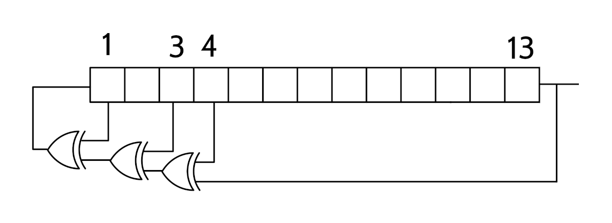

This module contains a compact and robust implementation of maximum-length linear feedback shift
registers (LFSR) in VHDL.
LFSRs are commonly used for pseudo-random number or unique counter generation in
FPGA/ASIC applications.

The maximum-length LFSR has the attractive property that it cycles through

.. math::

    2^\text{lfsr_length} - 1

unique states before repeating.
While the order of the states is completely deterministic, the output bit of the LFSR
behaves like a random number.
These properties are achieved using a very simple structure that is cheap to implement in FPGA:

  Example of a Fibonacci LFSR.

The long shift registers are especially cheap in devices that support packing shift registers
in LUTs (SRL).

Please see following sources for the mathematical background as well as details about the
LFSR properties:

* https://en.wikipedia.org/wiki/Linear-feedback_shift_register
* https://en.wikipedia.org/wiki/Maximum_length_sequence
* https://docs.xilinx.com/v/u/en-US/xapp210
