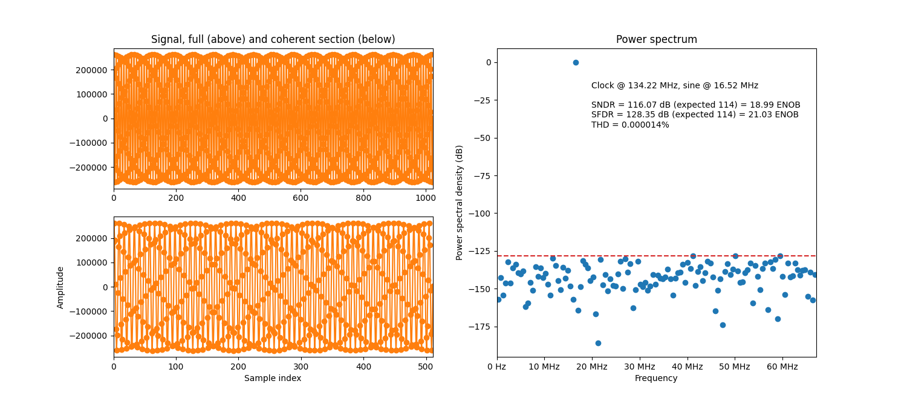
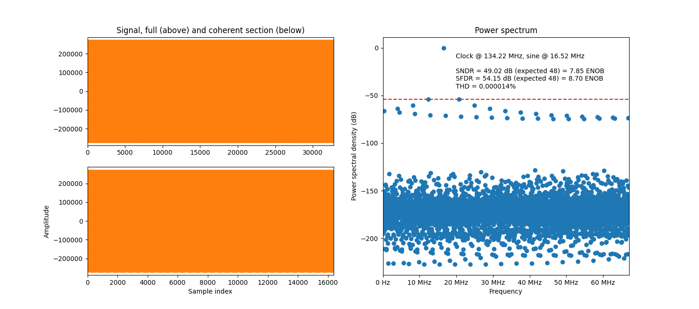
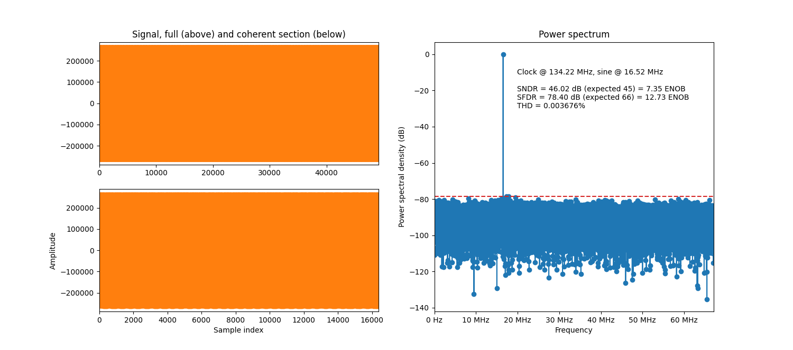
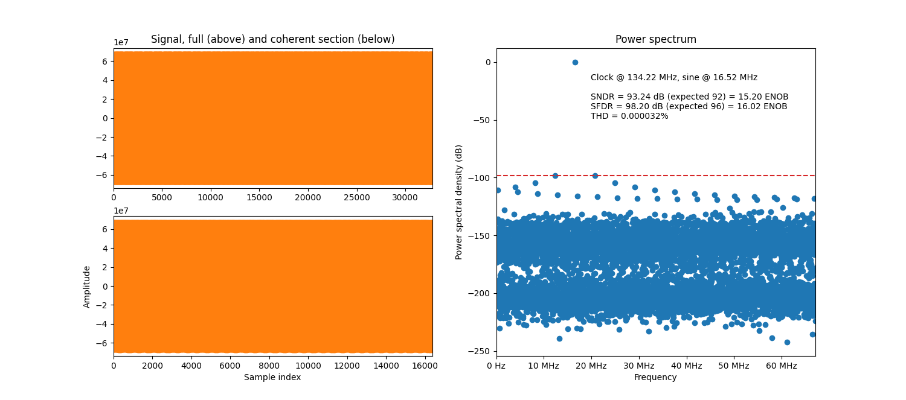

This module contains a flexible and robust sinusoidal waveform generator written in VHDL.
Also known as a direct digital synthesizer (DDS), numerically-controlled oscillator (NCO), or
a sine/sinus wave generator.
This is a very common component when doing any kind of signal processing, signal analysis or
modulation in an FPGA or ASIC.

Key features

* SFDR of 192 dB in fractional phase mode.
* Theoretically unlimited SFDR in integer phase mode.
* Both sine and cosine outputs, for I/Q modulation and other applications.
* Synthesizes frequencies all the way up to Nyquist.
* Written in pure VHDL. Needs no separate Matlab/Python tools to pre-calculate anything.
* Better performance and lower resource footprint compared to other implementations.

The implementation is based around a quarter-wave lookup table in block RAM.
It supports both integer and fractional phase modes, and can be parameterized
to use dithering and Taylor expansion to increase the performance, when necessary.
It is well-tested and well-analyzed.
The performance is proven by theory as well as simulation and on-device tests.

Quick start guide
-----------------

The theory behind this module is somewhat complex, and it has a number of parameters that must be
assigned and understood in order for things to work as intended.
While reading this full document is recommended for a full insight, below is a quick step-by-step
guide to utilizing the module.

1. Determine the :ref:`sine_frequency_resolution` requirement of your application.
2. Decide if you will use :ref:`sine_phase_mode`, given your requirements.
3. Parameterize the module to reach the desired performance, using either

   a. :ref:`sine_parameterize_integer_phase_mode` or
   b. :ref:`sine_parameterize_fractional_phase_mode`.

4. Determine your phase increment value based on :ref:`sine_calculate_increment`.
5. Instantiate the :ref:`sine_generator.sine_generator` entity in your design and start oscillating.

.. note::

  The performance of the module is measured in terms of the spurious-free dynamic range
  (SFDR) of the output signal.
  See https://en.wikipedia.org/wiki/Spurious-free_dynamic_range if you are not familiar with this.

.. _sine_frequency_resolution:

Frequency resolution
____________________

Frequency resolution is defined as the smallest output frequency step that can be taken by adjusting
``phase_increment``.
It is given by

.. math::

  \text{frequency_resolution_hz} \equiv \frac{\text{clk_frequency_hz}}{2^\text{phase_width}}
    = \frac{\text{clk_frequency_hz}}{
      2^{\text{memory_address_width} + 2 + \text{phase_fractional_width}}
    }.

Where ``clk_frequency_hz`` is the frequency of the system clock that is clocking this module,
and the ``memory_address_width`` and ``phase_fractional_width`` are generics to this module.
The resolution required depends on the application of the module, and must be determined by
the user.

.. _sine_phase_mode:

Integer or fractional phase mode
________________________________

If the :ref:`sine_frequency_resolution` requirement of your system can be satisfied with
``phase_fractional_width`` kept at zero, the module can operate in "integer phase" mode which has
many benefits.
Otherwise the module must operate in "fractional phase" mode, which comes with some drawbacks.
Note that the module will always use a memory that is

.. math::

  2^\text{memory_address_width} \times \text{memory_data_width}

large, and you must hence choose a maximum memory size that your design can afford.
The  ``memory_data_width`` is typically  18 and ``memory_address_width`` between 9 and 12, since
that maps very nicely to BRAM primitives.
But they can be both less or more.

.. _sine_parameterize_integer_phase_mode:

Parameterize in integer phase mode
__________________________________

In integer phase mode, the performance is limited only by the ``memory_data_width`` generic value
(see :ref:`sine_integer_phase_mode` for details).
The SFDR of the output signal is at least

.. math::

  \text{SFDR} = 6 \times (\text{memory_data_width} + 1) \text{ dB}.

Use this equation to determine the ``memory_data_width`` generic value you need, given your
SFDR requirement.
There is no need to adjust any other generic value to the generator top level.

.. _sine_parameterize_fractional_phase_mode:

Parameterize in fractional phase mode
_____________________________________

If we reorder the :ref:`sine_frequency_resolution` equation above, we get

.. math::

  \text{phase_fractional_width} = \left\lceil
    \log_2 \left( \frac{\text{clk_frequency_hz}}{\text{frequency_resolution_hz}} \right)
  \right\rceil
  - \text{memory_address_width} - 2.

Use this to calculate the ``fractional_phase_width`` generic value needed.

When in fractional phase mode, the performance is limited mainly by the ``memory_address_width``
generic value (see :ref:`sine_fractional_phase_mode` for details).
It can be improved by enabling :ref:`sine_phase_dithering` or :ref:`sine_phase_taylor`.
See the performance equations below to determine your required ``memory_address_width`` generic
value, and whether you want to set ``enable_phase_dithering`` or ``enable_first_order_taylor``.

Note that that in all cases using fractional phase mode, the ``memory_data_width`` generic must have
a value of at least

.. math::

  \frac{\text{SFDR}}{6} - 1

in order for the performance to not be limited by quantization noise.
A value of 18 is typical, since it maps nicely to a BRAM primitive, but it might have to be
increased in extreme performance scenarios.

.. _sine_fractional_performance:

Base fractional performance
~~~~~~~~~~~~~~~~~~~~~~~~~~~

If neither dithering nor Taylor expansion is enabled, the SFDR of the output signal is at least

.. math::

  \text{SFDR} = 6 \times (\text{memory_address_width} + 1) \text{ dB}.

Use this equation to determine the ``memory_address_width`` generic value you need, given your
SFDR requirement.

.. _sine_dithering_performance:

Performance with phase dithering
~~~~~~~~~~~~~~~~~~~~~~~~~~~~~~~~

When the :ref:`sine_phase_dithering` feature is enabled, the SFDR of the output signal is improved
to at least

.. math::

  \text{SFDR} = 6 \times (\text{memory_address_width} + 4) \text{ dB}.

Use this equation to determine the ``memory_address_width`` generic value you need, given your
SFDR requirement.

.. _sine_taylor_performance:

Performance with Taylor expansion
~~~~~~~~~~~~~~~~~~~~~~~~~~~~~~~~~

When the :ref:`sine_phase_taylor` feature is enabled, the SFDR of the output signal is improved
to at least

.. math::

  \text{SFDR} = 12 \times (\text{memory_address_width} + 1) \text{ dB}.

Use this equation to determine the ``memory_address_width`` generic value you need, given your
SFDR requirement.

.. _sine_integer_phase_mode:

About integer phase mode
------------------------

In integer phase mode, the phase, which is an accumulation of the input ``phase_increment``,
will always point exactly to an integer memory address.
Hence there is no truncation of the phase and no phase error.
See :ref:`sine_parameterize_integer_phase_mode` for an SFDR performance equation.

This means that the accuracy of the result is limited only by the bit width of the sine
samples in memory (``memory_data_width``).
And not at all by the number of samples in the memory (``memory_address_width``).
This leads to very high performance in typical scenarios.

  Example simulation with an integer phase increment.

.. note::

  Enabling :ref:`dithering <sine_phase_dithering>` or
  :ref:`Taylor expansion <sine_phase_taylor>` does nothing for the performance in integer
  phase mode.
  This is because both of these mechanisms work on the phase error, which is zero in integer
  phase mode.

.. _sine_fractional_phase_mode:

About fractional phase mode
---------------------------

In fractional phase mode, the phase will not always point exactly to a memory address.
Hence the phase is truncated, which leads to an error in the result.
I.e. worse performance.
See :ref:`sine_fractional_performance` for an SFDR performance equation.

The example simulation plot below has the same configuration as the integer phase example
above, except that the target sine frequency is slightly adjusted to require five fractional phase
increment bits.
The massive drop in performance is clearly visible.

  Example simulation with a fractional phase increment.

In this mode the input port ``phase_increment`` needs fractional bits in order to express the
desired sine frequency.
The generic ``phase_fractional_width`` must be set to a non-zero value so the desired frequency
resolution is reached.

.. _sine_phase_dithering:

Fractional phase with dithering
_______________________________

Phase dithering can be enabled to increase the performance in fractional phase mode by setting
the ``enable_phase_dithering`` generic.
See :ref:`sine_dithering_performance` for an SFDR performance equation.
See also :ref:`here <sine_generator_dithering>` for implementation details.

The result of simulating the example scenario from :ref:`sine_fractional_phase_mode` above, but with
dithering enabled, is shown below.

  Example simulation with a fractional phase increment and dithering.

As can be seen when comparing the performance to the non-dithered ditto above, the SFDR is better
but the SNDR is worse.
One can also note that the noise floor is much more uniformly spread out.

.. _sine_phase_taylor:

Fractional phase with Taylor expansion
______________________________________

Taylor expansion can be enabled to increase the performance in fractional phase mode by setting
the ``enable_first_order_taylor`` generic.
See :ref:`sine_taylor_performance` for an SFDR performance equation.
See also :ref:`here <sine_taylor_expansion>` for a background on the Taylor expansion concept.

The result of simulating the example scenario from :ref:`sine_fractional_phase_mode` above, but with
first-order Taylor expansion enabled, is shown below.

  Example simulation with a fractional phase increment and Taylor expansion.

As can be seen in the plot, both the SNDR and SFDR are massively improved.
Compared to the non-Taylor-expanded ditto above, the performance is roughly doubled.
Other than that, the noise floor is quite similar with distinct distortion peaks, but they are all
suppressed more by the Taylor expansion.
